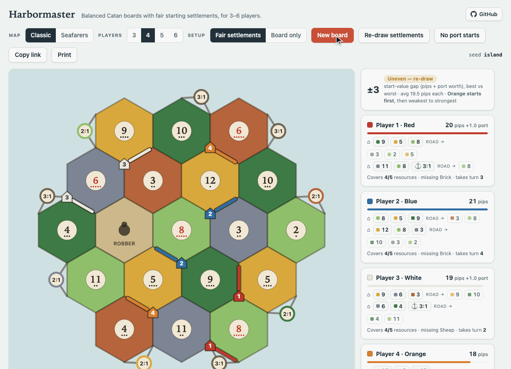

<div align="center">

# ⚓ Harbormaster

### The fair Catan setup generator that actually deals the whole table.

Board, numbers, ports, **and two balanced starting settlements + roads for every player** — before anyone touches a piece.

[**▶ Play it now → harbormaster.vercel.app**](https://harbormaster.vercel.app)

[](https://harbormaster.vercel.app)
[](LICENSE)




<sub><i>Every click deals a fresh board and a fair set of starting settlements — base and Seafarers, 3–6 players. The ± badge is the gap between the best and worst player.</i></sub>

</div>

---

## The problem every Catan night has

You shuffle the tiles. Someone lands on the double-wood-and-brick corner. The game is basically over and you are only on turn one. Everyone knows it. Nobody wants to reshuffle for the third time.

Every online generator will hand you a *board*. Not one of them tells each player **where to build**. But the settlement placement is the part your table actually argues about.

**Harbormaster deals the entire setup and proves it is fair before the first roll.**

- 🎲 A balanced board — no clustered red numbers, no resource deserts, even pip spread.
- ⛵ **Seafarers support** — the official *Heading for New Shores* scenario for 3–6 players:
  main island, small islands, gold fields, both number-token sets, harbors on the official
  scenario edges. Same fairness engine, starting settlements on the main island per the rules.
- ⚓ **Fixed ports read off a real physical frame**, so the screen matches the wood on your table.
- ⬡ **Two starting settlements and two roads per player**, matched so nobody starts ahead. Or flip to **Board only** and place your own, if you like the placement duel (it even tells you the pip gap a solid snake draft would land at).
- 🥇 A suggested turn order that hands first move to the weakest hand.
- 🚫⚓ **No port starts** toggle for pure production starts.
- 🖨️ **Print** button with a print-friendly layout for the table.
- 🔗 A seed in the URL, so you send one link and everyone sees the identical table.

No signup. No app. One HTML file. Works on the phone that is already on the table.

---

## Cargo manifest

| | |
|---|---|
| **Two modes** | *Fair settlements* deals everyone their spots; *Board only* gives a balanced board and lets you draft. |
| **3 to 6 players** | Official 19-hex base board and the 30-hex 5–6 player extension. |
| **Fair settlements** | Every player gets two spots under the distance rule, matched by *start value*. |
| **Starting roads** | Each road points at the best legal expansion. Weakest hands get first pick. |
| **Real ports** | Harbor layout traced from photos of the actual game frame ([here](docs/frames)). |
| **Turn order** | Weakest start plays first, to cancel the last sliver of imbalance. |
| **Shareable** | `#s=<seed>&p=<players>` reproduces any table exactly. |
| **Themed** | Light and dark, follows your device. |
| **Honest** | A `±N` readout shows the gap between the best and worst hand at a glance. |

---

## Charting the balance

"Balanced" is not a vibe here. It is a number, and every generated table is optimized against it.

**Pips are the currency.** Each number token carries dots equal to the ways two dice roll it — a `6` or `8` has five, a `2` or `12` has one. Sum the dots across the hexes a settlement touches and you have its expected income. A player's **start value** is the pips of both settlements plus the worth of any port they sit on (a 3:1 counts as `+1`, a 2:1 as `+1.5`, a little more when they actually produce what it trades).

The generator then enforces, on every board:

- No `6` or `8` adjacent to another `6` or `8`.
- No two identical numbers touching, no `2` beside a `12`.
- No two hexes of the same resource touching.
- Pips spread evenly *per resource*, so ore is not quietly starved while wood is loaded.
- A 2:1 port never sits on a hex of its own resource (the classic broken corner).

Settlements are dealt by pairing the strongest opening spot with the weakest, then swap-optimizing until three things hold at once: the value gap between players shrinks, everyone touches enough different resources, and access to the red `6`/`8` numbers is spread around. Turn order mops up whatever gap survives.

**Does it work?** A Playwright harness generates hundreds of tables across every player count and checks them. Latest run, 400 setups:

- Every hard rule: **0 violations.**
- Start-value gap of **1 pip or less in ~93%** of tables, **2 or less in ~100%.**
- For comparison, the way most groups draft by hand lands inside 1 pip only about **half** the time.

Run it yourself: `node test/test_balance.mjs "$PWD" 100`.

---

## The ports were traced from real wood

Most generators shuffle the harbors randomly, which means the screen never matches your board. Harbormaster does the opposite. The port sequence is **hardcoded from photographs of a physical Catan frame** (both the 4-player and 5–6 player frames live in [`docs/frames/`](docs/frames)). The land is then balanced *around* those fixed ports.

Rotate your frame once so the harbors line up with the drawn board, and the tiles, tokens, settlements, and ports all agree. If a token ever disagrees with your set, it is a one-line fix in `SETUPS.*.portSeq` — see [CONTRIBUTING](CONTRIBUTING.md).

---

## Setting sail locally

No toolchain. It is one file.

```bash
git clone https://github.com/sushobhith/harbormaster.git
cd harbormaster
open index.html          # or: python3 -m http.server, then visit localhost:8000
```

To run the test harness (the only thing that needs a dependency):

```bash
npm install              # pulls playwright, for the headless tests only
node test/test_balance.mjs "$PWD" 100   # balance simulation across 3-6 players
node test/test_page.mjs "$PWD"          # render + constraint smoke test
```

Deploy is a static push — the live site runs on Vercel with zero configuration.

---

## Join the crew

Contributions welcome, especially:

- **Port corrections** if your frame differs from the one in `docs/frames/`.
- A **no-ports-on-starts** toggle (pure-production openings).
- A **print-friendly** layout for the table.
- Seafarers / Cities & Knights board shapes.

Start with [CONTRIBUTING.md](CONTRIBUTING.md) and [CLAUDE.md](CLAUDE.md) (the full architecture tour). The whole app is one readable `<script>` in `index.html`, no framework to learn.

---

## License

[MIT](LICENSE). Free for any use.

CATAN® is a trademark of CATAN GmbH. This is an unofficial fan project, not affiliated with or endorsed by CATAN GmbH or Catan Studio. Bring your own board.

<div align="center">
<sub>Built for a game group that was tired of unfair opening hands.</sub>
</div>
